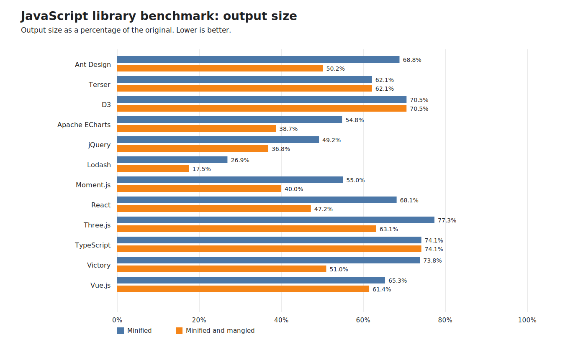

Current size-reduction baselines
================================

| Library | Original bytes | Minified bytes | Reduction | Minified and mangled bytes | Reduction |
| --- | ---: | ---: | ---: | ---: | ---: |
| `Ant Design` | 4427342 | 3046996 | 31.2% | 2174382 | 50.9% |
| `Terser` | 1082433 | 672454 | 37.9% | 672405 | 37.9% |
| `D3` | 587043 | 414086 | 29.5% | 414037 | 29.5% |
| `Apache ECharts` | 3847293 | 2108880 | 45.2% | 1457783 | 62.1% |
| `jQuery` | 255967 | 125920 | 50.8% | 90384 | 64.7% |
| `Lodash` | 545945 | 146740 | 73.1% | 84326 | 84.6% |
| `Moment.js` | 176435 | 97098 | 45.0% | 68129 | 61.4% |
| `React` | 47219 | 32167 | 31.9% | 21916 | 53.6% |
| `Three.js` | 650153 | 502777 | 22.7% | 409312 | 37.0% |
| `TypeScript` | 9144216 | 6779671 | 25.9% | 6779671 | 25.9% |
| `Victory` | 1837205 | 1355855 | 26.2% | 911411 | 50.4% |
| `Vue.js` | 586127 | 382734 | 34.7% | 360085 | 38.6% |
